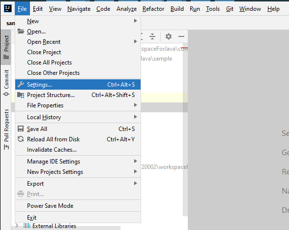

# env-setup

> Guideline for setting up nexus repository and intellij

## Nexus Repository

It is recommended to use nexus as maven repository. We will donwload all dependencies from nexus which requires office network.
If you find the nexus proxy does not include some third party maven repositories that you need to download depenpencies from, please contact Max Wong at max.yf1.wong@pccw.com.

1. Create or replace ~/.m2/settings.xml as below.

```
<settings xsi:schemaLocation="http://maven.apache.org/SETTINGS/1.1.0 http://maven.apache.org/xsd/settings-1.1.0.xsd"
    xmlns="http://maven.apache.org/SETTINGS/1.1.0"
    xmlns:xsi="http://www.w3.org/2001/XMLSchema-instance">
    <mirrors>
        <mirror>
            <id>nexus</id>
            <url>https://nexus.urcicd.sitelb.bpu.pccw.com/repository/maven/</url>
            <mirrorOf>*</mirrorOf>
        </mirror>
    </mirrors>
</settings>
```

2. Import nexus cert from this repo into java cacerts (need admin rights)

```
keytool -import -alias nexus -file nexus.cer -keystore "%JAVA_HOME%/lib/security/cacerts"
```

3. Get a maven project and do `mvn compile` should see maven downloading dependencies from nexus instead of maven central.

## Intellij Setup

> Download [Intellij](https://www.jetbrains.com/idea/download/#section=windows) community version.

### Auto format Combo

1. Install [google-java-format](https://plugins.jetbrains.com/plugin/8527-google-java-format) and [save actions](https://plugins.jetbrains.com/plugin/7642-save-actions) plugins.  
   File -> Settings -> Plugins -> Marketplace -> Search `google-java-format` and `save actions` -> Install -> Restart IDE
     
   After installation, the two pulgins should be in the installed list.  
   
1. Config `New Project Settings`.  
   File -> New Project Settings -> Settings for New Projects... -> Other Settings  
   Follow the settings as shown in the screens. (4 spaces indent for android style)  
     
   
1. Now intellij will auto format your code on save.

### Enable Hot Reload

To enable spring-boot-devtools for easier development, we need to do the following config as described in this [post](https://stackoverflow.com/questions/33869606/intellij-15-springboot-devtools-livereload-not-working).

1. File -> New Project Settings -> Settings for New Projects... -> Build, Execution, Deployment -> Compiler  
   Check `Build Project Automatically`  
   
1. SHIFT+Ctrl+A -> registry-> compiler.automake.allow.when.app.running  
   

### Enable Lombok

[Lombok](https://projectlombok.org/) saves us many clumsy getter/setter and brings us convenient annotations.

1. File -> New Project Settings -> Settings for New Projects... -> Build, Execution, Deployment -> Compiler -> Annotation Processors  
   
